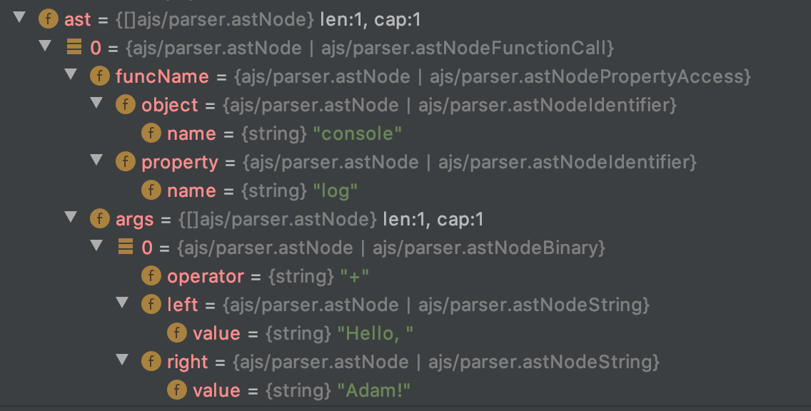

# aJS - A Go JavaScript parser, someday.

Hello there! 👋

Please don't mind me while I play with some Golang.

For my first project in this new language, I've chosen to have a *go* at writing
a JavaScript parser. It doesn't do much at the moment, but one day I'd like
to finish it or maybe even add a basic interpreter.

## Current (*experimental!*) features

Parsing for:

 - Function definitions
 - Function calls
 - Left-associative binary operators
 - Strings, numbers and identifiers
 - Property access
 - Variable assignment (var/let/const/re-assignment)

I am currently judging correct parser output as being similar to that of 
[ASTExplorer](https://astexplorer.net/) with the 
[acorn 7.0.0](https://github.com/acornjs/acorn) backend.

I am not (yet) planning to support any fancy new features like generator
functions, classes, or most ES6 syntax.
